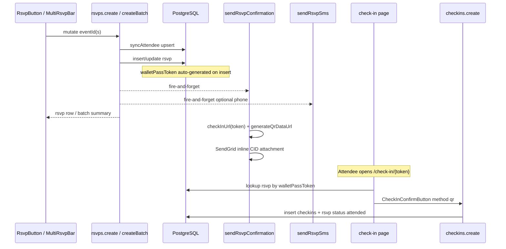

# RSVP → Email QR → Check-in Flow

End-to-end trace of the free RSVP path from the browser through persistence, notifications, and door check-in.

## Sequence diagram



## 1. Client entry points

| Component | File | Procedure |
|-----------|------|-----------|
| Single event RSVP | `apps/web/components/rsvp/RsvpButton.tsx` | `trpc.rsvps.create.mutate({ eventId })` |
| Multi-select bar | `apps/web/components/rsvp/MultiRsvpBar.tsx` | `trpc.rsvps.createBatch.mutate({ eventIds, churchSlug, churchName })` |
| Session picker | `apps/web/components/events/SessionPicker.tsx` | `createBatch` for child sessions |

Paid events use `CheckoutModal` instead of `rsvps.create` (Stripe path — not covered here).

tRPC client: `apps/web/lib/trpc-client.ts` → `POST /api/trpc/rsvps.create` with superjson body `{ json: input }`.

## 2. `rsvps.create` (single event)

**File:** `apps/web/server/trpc/routers/rsvps.ts`

1. **Auth** — `protectedProcedure` ensures `ctx.clerkUserId` (Supabase user id).
2. **Load event** — `events` by `eventId`; 404 if missing.
3. **syncAttendee** — `currentUser()` profile → upsert `attendees` on `(churchId, clerkUserId)`.
4. **Idempotency** — existing non-cancelled RSVP returns early; cancelled RSVPs reactivate.
5. **Capacity** — counts non-cancelled RSVPs vs `event.capacity`.
6. **Persist** — insert or update `rsvps`; **`walletPassToken`** defaults via schema `$defaultFn(() => createId())`.
7. **Email** — `sendRsvpConfirmation({ walletPassTokens: [token], events: [...], appUrl })` — `.catch()` only logs errors.
8. **SMS** — if attendee has `phone`, `sendRsvpSms` with `checkInUrl(token)` for single event.

## 3. `rsvps.createBatch`

Same attendee sync; enforces all `eventIds` share one `churchId`. Inserts/reactivates per event, builds `tokenByEventId`, emails **all** selected events (including already-RSVPd), SMS may include per-event check-in URLs or `/my-events` for multi-event.

## 4. QR URL and email

**URL builder:** `apps/web/lib/qrcode.ts`

```ts
checkInUrl(token) → `${NEXT_PUBLIC_APP_URL}/check-in/${token}`
```

**Email:** `apps/web/lib/sendgrid.ts` → `withQrAttachments()`:

- For each event index `i`, generates PNG via `generateQrDataUrl(checkInUrl(token))`.
- Attaches as SendGrid inline `contentId` for HTML template.
- No-op logs preview when `SENDGRID_API_KEY` is unset.

Template: `apps/web/lib/email-templates/rsvp-confirmation.ts`.

## 5. Post-RSVP ticket surfaces

| Surface | How token is used |
|---------|-------------------|
| Event detail | `MyTicket` — server query RSVP by user + event; QR encodes `checkInUrl(token)` |
| My Events | `app/my-events/page.tsx` — all RSVPs; modal QR + wallet links |
| Email | Inline CID QR images |

## 6. Check-in

**Public page:** `apps/web/app/check-in/[token]/page.tsx`

- Server: `rsvps.walletPassToken = params.token` → join attendee, event, church, existing `checkins`.
- If not checked in: `CheckInConfirmButton` with `walletPassToken` + `eventId`.

**Mutation:** `apps/web/server/trpc/routers/checkins.ts` → `create` (**publicProcedure**)

```ts
checkins.create({ walletPassToken, eventId, method: "qr" })
```

1. Resolve RSVP by token.
2. Insert `checkins` row (`method: "qr"`).
3. Set `rsvps.status = "attended"`.

**Admin manual check-in:** guest list uses `checkins.manual` / `undoManual` (see [TRPC_AUTH_MATRIX.md](./TRPC_AUTH_MATRIX.md)).

## 7. Debugging checklist

| Step | What to verify |
|------|----------------|
| RSVP | Network tab: `rsvps.create` returns `walletPassToken` |
| DB | `rsvps` row for attendee + event with `status = confirmed` |
| Email | Console `[sendgrid]` logs if no API key; else inbox + inline QR |
| QR scan | Open `/check-in/{token}` while signed out (public) |
| Check-in | `checkins.create` returns checkin row; RSVP `attended` |

## Key files (quick reference)

```
components/rsvp/RsvpButton.tsx
components/rsvp/MultiRsvpBar.tsx
server/trpc/routers/rsvps.ts
lib/sendgrid.ts
lib/qrcode.ts
lib/sms.ts
app/check-in/[token]/page.tsx
components/rsvp/CheckInConfirmButton.tsx
server/trpc/routers/checkins.ts
packages/db/src/schema/rsvps.ts
```
